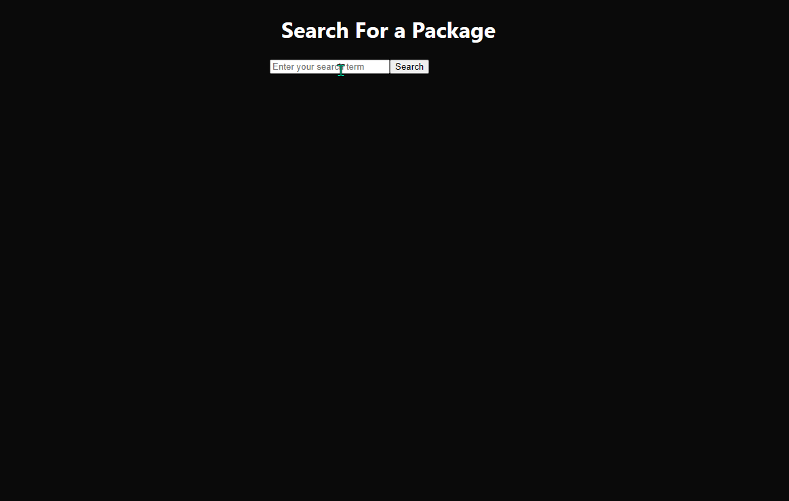

# Search Packages

A simple project that shows how to use React with Redux and Typescript.

## Tech Stack

<p align="left">


</p>

## Features

- Search packages of npm and return the package names found by that term.

## Demo



## Run Locally

Clone the project

```bash
  git clone https://github.com/aniltulebag/search-packages.git
```

Go to the project directory

```bash
  cd search-packages
```

Install dependencies

```bash
  npm install
```

Start the server

```bash
  npm run start
```

## Deployment

To deploy this project run

```bash
  npm run build
```

## License

[MIT](https://choosealicense.com/licenses/mit/)
